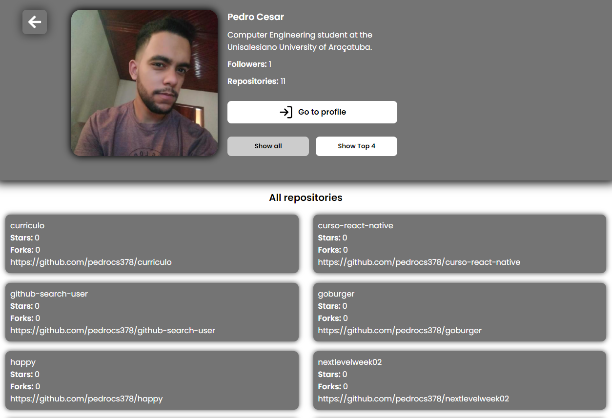

# GitProfile

## :rocket: Tecnologias

O projeto foi desenvolvido com as seguintes tecnologias:

- [React](https://reactjs.org/)
- [Typescript](https://www.typescriptlang.org/)
- [Axios](https://github.com/axios/axios/)

## :computer: Projeto

Este projeto é uma pequena ideia utilizando da API do GitHub para recuperar informações do usuário quando um nome de usuário válido é inserido. Nele é exibido avatar, nome de usuário, contagem de seguidores, contagem de repositórios, os repositórios do usuário ou os 4 principais repositórios baseado em estrelas e forks.

## :bookmark: Layout

Abaixo estão o layout das duas telas desenvolvidas.

    
     
     
    
     
     
    

## :clapper: Execução
* Instale as bibliotecas utilizando `npm install` ou qualquer outro gerenciador de pacotes.
* Execute utilizando `npm start`.  
